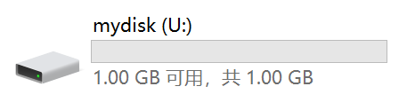

# 万能硬盘！

大家知道fsspec吗？fsspec是1个可以将各种东西映射为Python文件系统的库，比如可以open 1个云存储上的文件。

于是聪明的莉沫酱就想到，既然可以映射到Python文件系统，那是不是也可以进1步映射到windows的硬盘？

这样1来，我们只要去弄1些免费的云存储，比如Cloudflare R2，就相当于多了1块免费的移动硬盘，真是太好啦！


## 安装方法

1. 首先你要有1台装了Python的windows电脑。

2. 先安装1个[WinFSP](https://winfsp.dev/rel/)。

3. 然后`pip install git+https://github.com/RimoChan/fsspec_disk.git`就可以啦！


## 样例

以cloudflare r2为例——

首先我们去[cloudflare r2](https://www.cloudflare.com/developer-platform/products/r2/)，在仪表盘里面新建1个存储桶+1个API令牌。


接下来运行这个命令:

```sh
python -m fsspec_disk.demo_s3 --bucket 你的存储桶的名字 --endpoint_url 你的endpoint_url --key 你的令牌的key --secret 你的令牌的secret --volume_label mydisk
```

然后就可以在电脑里看到这个新硬盘了，这个硬盘里的东西就和你的存储桶里面是同步的。



你还可以把这个命令发给别人，这样就可以直接和他们共享云盘，非常方便！


## 接口

接口只有1个，就是`fsspec_disk`。

```python
def fsspec_disk(mountpoint: str, fsspec_system: fsspec.AbstractFileSystem, **kwargs)
```

- mountpoint: 要把盘挂在哪个盘符下。

- fsspec_system: 1个fsspec的文件系统。

- kwargs目前有3个，分别是:
    - log: 是否显示log
    - volume_label: 硬盘显示的名字
    - use_elf_mkdir: 是否使用假文件来创建目录，因为有些云存储不支持mkdir


## 结束

对了，这个东西还在开发中，所以应该会有bug，大家1定要把重要文件在本地做上备份，因为文件丢了我也不会给你赔钱的！

就这样，我要去买SSD了，大家88！
